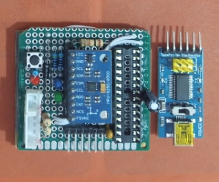
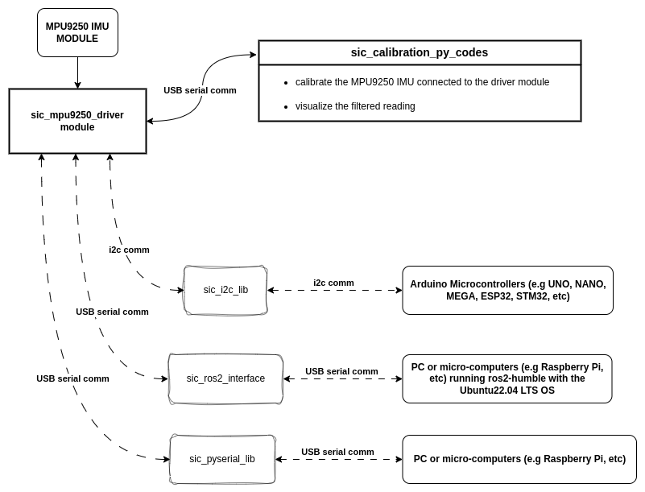

# Samuko IMU Compute MPU9250 (`sic_mpu9250`) Project
The parent repo of **`sic_mpu9250`** Project.
 
 
A common problem faced in robotics (or embedded developments) is calibration, setting up and processing filtered readings of an Inertia Measurement Unit (IMU). 
 
Setup processes like magnetometer, gyroscope and accelerometer calibration are usually an issue and can be frustrating as wrong calibration will result to faulty readings. Also, one would usually like to get a less noisy orientation (roll, pitch and yaw) readings i.e the noice should be well filtered. 
 
 
The AIM of `sic_mpu9250` project is to design and make available an easy interfacing, calibration and computation system `(i.e a physical module, software and libraries)` for the `MPU9250 module` to easily calibrate its sensors (i.e magnetometer, gyroscope and accelerometer), integrate it with ros2 imu_tools package to get well filtered imu data readings for your ros2 project and also integrating it with arduino-based projects (using a kalman filter code).

>The `sic_mpu9250` will allow the user to:
> - easily connect/interface the `MPU9250 module`.
> - easily calibrate the `MPU9250 module`.
> - easily integrate it into a ROS2-based project with the ros2 imu tools package.
> - easily integrate it into a microcontroller-based (Arduino) project (with an available kalman filter code).

 
The `sic_mpu9250` project consist of the following sub-parts:

- **`sic_mpu9250_driver module`**: this a the physical module to which the `MPU9250 IMU module` is interfaced/connected to via header pins. The module provides a USB serial communication interface using the FTDI programmer to connect with a PC or micro-computer to setup, calibrate, visualize, and use in projects. It also provides an I2C communication interface for microcontroller-based (Arduino) projects.

- **`sic_mpu9250_driver_code`**: this is the code uploaded to the `sic_mpu9250_driver module`. it basically enables communication with the `MPU9250 IMU` as well as serial and I2C communication with other microcomputer or microcontrollers. the driver code is divided into two parts - the `calibration` code and `kalman filter` code. The calibration code, which comes default with driver module, allows the easy calibration of the MPU9250 IMU and use with ros2 with the imu_tools package. The Kalman filter code is needed for arduino based project (python/cpp based micro-computer projects). Here's the link to the repo -> [sic_mpu9250_driver_code](https://github.com/samuko-things-company/sic_mpu9250_driver_code)  

- **`sic_mpu9250_setup_py_codes`**: set of step by step codes to help calibrate, compute necessary covariances, and visualize the filtered readings of the IMU (`MPU9250 module`) connected to the `sic_mpu9250_driver module`. Here's the link to the repo -> [sic_mpu9250_setup_py_codes](https://github.com/samuko-things-company/sic_mpu9250_setup_py_codes)

- **`sic_mpu9250_ros2 package`**: This is used with the ros2 imu_tools package. It connects the calibrated MPU9250 with the ros2 imu tools package to get filtered imu data readings (using the madgwick filter). It requres that the `calibration code` is running on the `sic_mpu9250_driver module`. Here's a link to the repo -> [sic_mpu9250_ros2](https://github.com/samuko-things-company/sic_mpu9250_ros2) 

- **`sic_mpu9250_i2c_lib`**: arduino library that helps communicate with the already setup IMU (`MPU9250 module`) via I2C ADDRESS - 0x68, in your arduino-based project (e.g Arduino nano, UNO, MEGA, ESP32, e.t.c). It requres that the `kalman filter code` is running on the `sic_mpu9250_driver module`. here's the link to the repo -> [sic_mpu9250_i2c_lib](https://github.com/samuko-things-company/sic_mpu9250_i2c_lib)

- **`sic_mpu9250_pyserial_lib`**: library that helps communicate with the already setup IMU (`MPU9250 module`) in you PC or microcomputer-based python projects. It requres that the `kalman filter code` is running on the `sic_mpu9250_driver module`. here's a link to the repo -> [sic_mpu9250_pyserial_lib](https://github.com/samuko-things-company/sic_mpu9250_pyserial_lib). Here's the cpp equivalent also -> [sic_mpu9250_cppserial_lib](https://github.com/samuko-things-company/sic_mpu9250_cppserial_lib)

 
 

## HOW TO USE THE **`sic_mpu9250`** IN YOUR PROJECT
- First of all get the **`MPU9250 IMU module`** and **`sic_mpu9250_driver module`** (it will come preloaded with the `calibration code` and also with an FTDI serial programmer for USB serial communication).
  > NOTE: you can also upload the `calibration code` to the driver module.

- Interface/connect the **`MPU9250 IMU module`** to the **`sic_mpu9250_driver module`** via the header pin.

- clone or download the **`sic_mpu9250_setup_py_codes`** repo into your PC.

- Connect the **`sic_mpu9250_driver module`** to your PC via the FTDI and follow the **`sic_mpu9250_setup_py_codes`** step by step to setup the calibration and cavariance parameters of the IMU.
  > **NOTE:** the parameter values you set are automatically saved to the microcontroller's EEPROM memory (i.e it remembers the parameter values)

- After successfully setup, disconnect the driver module from the PC and hit the reset button on the `sic_mpu9250_driver module`.

- While the driver module still has the `calibration code` on it, you can use it with ros2-based project
  > NOTE: you can also upload the `calibration code` to the driver module.

- to use with arduino-based or python/cpp based project, upload the `kalman filter` code to the `sic_mpu9250_driver module` and use with your prefered library - `sic_mpu9250_i2c_lib` or `sic_mpu9250_pyserial_lib` or `sic_mpu9250_cppserial_lib`.

## RESOURCES USED AND THEIR REFERENCES

|S/N|AUTHOR(S)|INFO/LINKS|WHERE/HOW IT WAS USED|
|--|--|--|:--:|
|01|Tesla Labs|[Magnetometer Calibration](https://teslabs.com/articles/magnetometer-calibration/)|I adapted the ellipsoid fit algorithm for the sic magnetometer calibration in the **`sic_calibration_py_codes`**.|
|02|TKJ Electronics -> Sept 10, 2012|[Kalman FIlter For IMU](https://blog.tkjelectronics.dk/2012/09/a-practical-approach-to-kalman-filter-and-how-to-implement-it/)|IMU Kalman filter algorithm in the sic driver code **`sic_mpu9250_driver_code`**.|
|03|Brian Douglas (Matlab Tech Talks)|[Understanding IMU Sensor Fusion](https://www.youtube.com/watch?v=0rlvvYgmTvI&t=317s)|This work formed a base structure used in the **`sic`** sensor fusion steps.|
|04|Carbon Aeronautics|[Kalman FIlter With Gyro and Acc](https://www.youtube.com/watch?v=5HuN9iL-zxU)|sic driver code  IMU Kalman filter|
|05|Bolder Flight (MPU9250 Library)|[MPU9250 library - Github](https://github.com/bolderflight/invensense-imu)|The library was used to communicate with the MPU9250 interfaced with the sic driver module to get raw Acc, Gyro, and Mag readings.|
|06|Lady Ada (Adafruit Sensor Lab)|[Magnetometer Calibration Visualization](https://learn.adafruit.com/adafruit-sensorlab-magnetometer-calibration/magnetic-calibration-with-jupyter) [Gyro Calibration Visualization](https://learn.adafruit.com/adafruit-sensorlab-gyroscope-calibration/gyro-calibration-with-jupyter)|Magnetometer Calibration  Data Visualization I adapted the gyro calibration algorithm and visualization for the sic calibration process.|
|07|Paul McWhorter (9axis IMU LESSONS)|[IMU Viz Pitch and Yaw](https://www.youtube.com/watch?v=iQ2zX4_Ftv8&t=247s) [IMU Viz Roll, Pitch and Yaw](https://www.youtube.com/watch?v=7B3KnAj7xzY) [IMU Viz RPY Quaternion](https://www.youtube.com/watch?v=S77r-P6YxAU&t=2004s)|sic IMU visualization Python code|
|08|Flynneva (BNO055 ros2 pkg)|[BNO055 ros2 - Github](https://github.com/flynneva/bno055/tree/main)|I adapted it in developing the sic ros2 interface package.|
|09|Automatic Addison (Eular - Quaternion Conversion)|[Quat To Euler Conversion](https://automaticaddison.com/how-to-convert-a-quaternion-into-euler-angles-in-python/)|Adapted it in Arduino code as well as ROS2 interface code to perform conversion between eular and quaternions.|
|10|Brandon McCarron June 2013|[Low-Cost IMU Implementation via Sensor Fusion Algorithms in the Arduino Environment - Journal](https://core.ac.uk/download/18293757.pdf)|IMU Kalman filter algorithm in the sic driver code.|
|11|Obiagba Samuel|[Serial Communication between Arduino and PC - Github](https://github.com/samuko-things/serial_comm_pyserial_and_arduino)|Formed the basis of the communication algorithm used in the **`sic_pyserial_lib`** and the driver code|